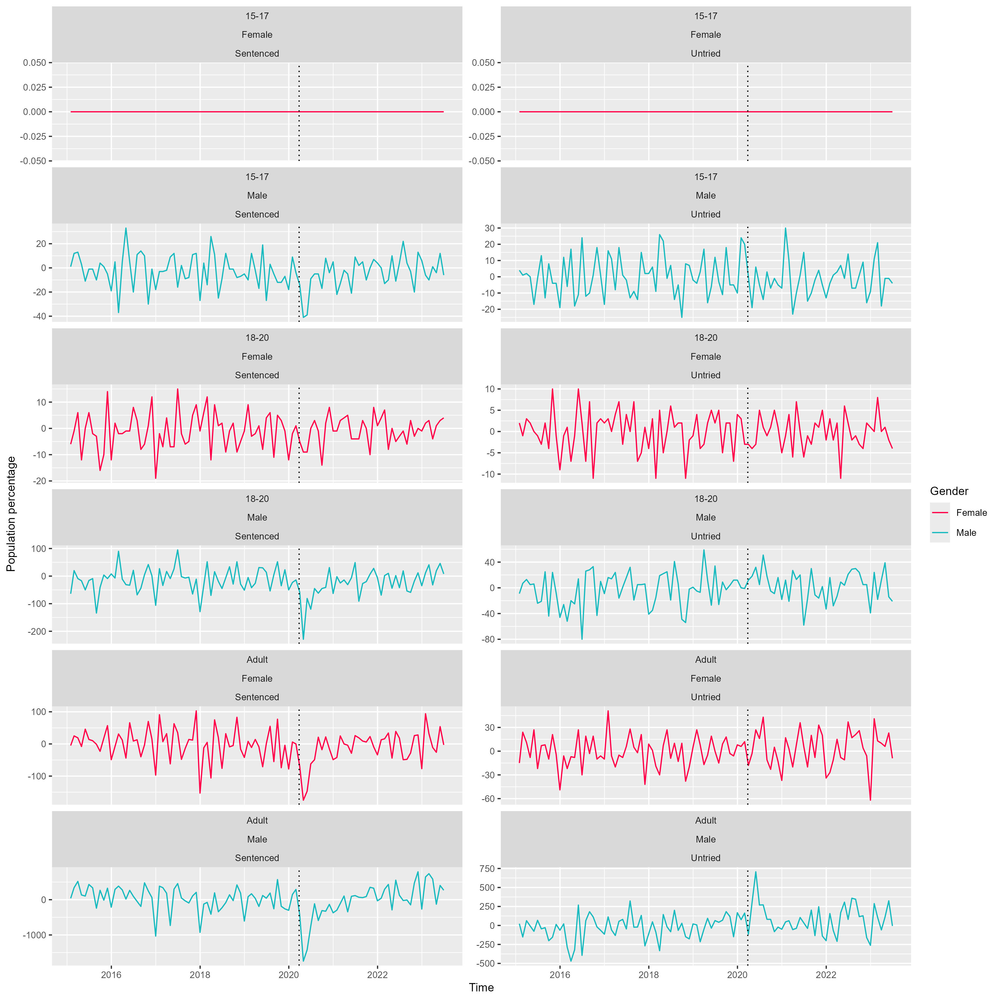
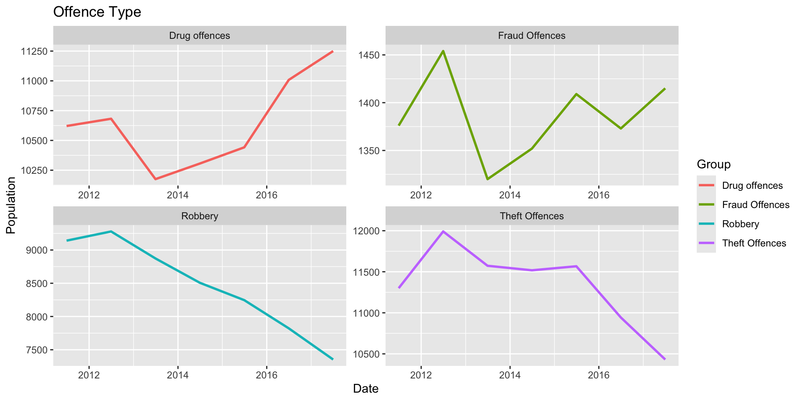
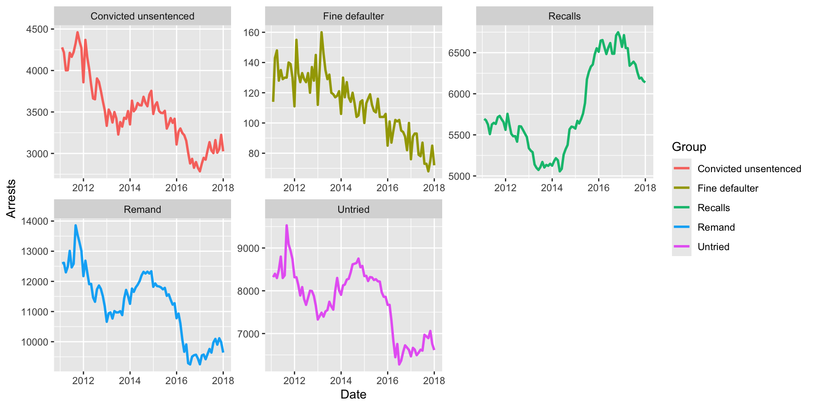
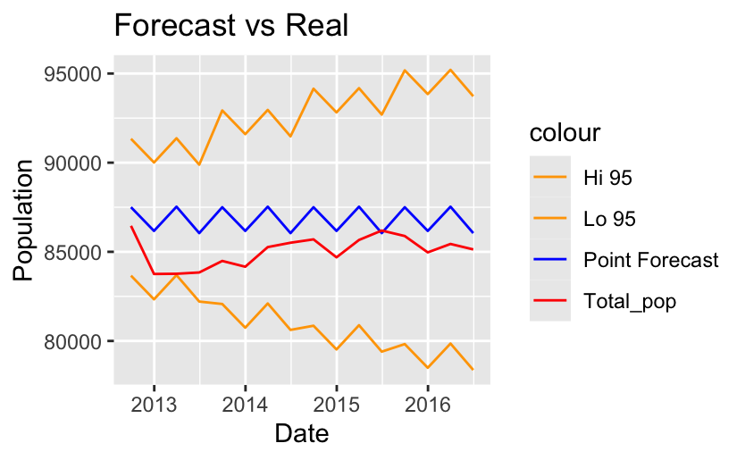
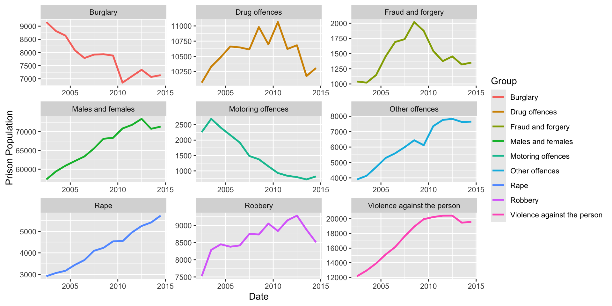

```{r install-package, include = FALSE, eval = FALSE}
# Copy and paste the following code into your console to download and install
# the `xaringan` package that contains all of the code which allows you 
# to create presentation slides in Rmarkdown
install.packages('xaringan')
```


```{r load-packages, echo = FALSE, include = FALSE, out.width="80%"}
# Add any additional packages you need to this chunk
library(tidyverse)
library(tidymodels)
library(palmerpenguins)
library(knitr)
library(xaringanthemer)
library(ggplot2)

library(readODS)
library(janitor) #for changing row names
library(RColorBrewer)

```

```{r setup, include=FALSE}
# For better figure resolution
knitr::opts_chunk$set(fig.retina = 3, dpi = 300, fig.width = 6, fig.asp = 0.4, out.width = "80%")
```

```{r load-data-and-func, echo = FALSE, warning = FALSE, message = FALSE}
Custody_PD <- read_ods('data/Population_30June2023_Annual.ods', sheet = 2)

#wrapper function for generating title of plots
wrapper <- function(x, ...) 
{
  paste(strwrap(x, ...), collapse = '\n')
}

#normalises data to range from 0 to 1
normalise_01 <- function(x)
{
  if (min(x) < 0 )
  {
    x/max(abs(x))
  } else {
    (x-min(x))/(max(x)-min(x))
  }
}


```


class: center, middle

#Correlation Between Significant Events and Prison Population of England and Wales

---
class: inverse, left, middle

## A look at the effect of COVID-19 on prison population

We explored the effect of lockdown measures in UK on the prison population.

Data we looked at is grouped by Custody type:
1. Sentenced (supergroup of all length-determined sentences, e.g. 7-10 yrs)
  - This group contains miscellaneous subgroups such as "Sentence length not recorded".
2. Remand (i.e. pre-trial detention)
3. Non-criminal prisoners (civil offenders)

And is sorted by gender (Male & Female). Most prisoners are male.

---
## Important dates used for modeling

- First lockdown enforced: $^1$
  - March 26, 2020
- Most lockdown restrictions lifted (until start of 2nd lockdown): $^2$
  - July 4, 2020
- All lockdown restrictions lifted for the last time: $^3$
  - June 19, 2021

.footnote[
[1] Institute for Government analysis, https://www.instituteforgovernment.org.uk/sites/default/files/timeline-lockdown-web.pdf , retrieved November 26, 2024

[2] UK Parliment, Coronavirus: A history of English lockdown laws, https://commonslibrary.parliament.uk/research-briefings/cbp-9068/ , retrieved November 26, 2024

[3] BBC, Covid: England lockdown rules to end on 19 July, PM confirms, https://www.bbc.co.uk/news/uk-57809691
]

---
(Explain custody types with pos and neg reaction to covid.)

---

.pull-left[


]
.pull-right[

]

---
#REFORMS

```{R Marcel_Siddhi_graph,echo = FALSE}


```
---
```{R Marcel_Siddhi_graph2,echo = FALSE, fig.width=4, fig.height=4,}

```
---
.pull-left[
- Siddhi
- Marcel
]
.pull-right[
```{R Marcel_Siddhi_graph3, out.width="500%", fig.width=4,echo = FALSE}



```
]
---
#PRIME MINISTERS - David Cameron
#####David Cameron, a Conservative, was the UK Prime Minister from 2010 to 2016. He implemented austerity measures and held the 2016 EU referendum, leading to Brexit and his resignation.

```{R Hanna_Vivi graph,echo = FALSE}


```
---
###Key Insights from Results:

####Drug Offenses:
- Prison populations for drug offenses significantly declined as Cameron's government prioritized dismantling organized drug networks and de-emphasized minor drug possession. Expanded funding for drug rehabilitation programs and harm reduction reflected this shift.
####Fraud and Forgery:
- Fraud-related imprisonment decreased, driven by a shift toward online financial crimes, which were harder to prosecute under reduced police resources. Cameron's government encouraged private sector involvement in financial crime prevention.
####Motoring Offenses:
- A consistent decline in motoring offense imprisonment occurred due to increased use of automated systems (e.g., speed cameras) and alternative penalties like fines. Resource cuts impacted manual enforcement further.
---

####Rape and Sexual Offenses:
- Increased awareness campaigns and judicial reforms led to rising imprisonment for rape offenses. Initiatives like #MeToo and longer sentencing reflected societal shifts.
####Robbery:
- Prison populations for robbery offenses fluctuated, peaking around 2013 due to economic challenges and declining thereafter. Urban safety initiatives and improved surveillance reduced robbery rates.
####Violence Against the Person:
- Prison populations grew until 2013, influenced by tougher sentencing policies. Cameron introduced domestic violence legislation and community-based violence prevention programs.
####Burglary: 
- Declining arrests reflect improved security technologies and reduced police presence under austerity. Emphasis on community policing and public safety campaigns shaped outcomes.

---
#PRIME MINISTERS - Theresa May

#####Theresa May is a British politician who served as the Prime Minister of the United Kingdom from July 2016 to July 2019. A member of the Conservative Party, she was the second woman to hold the office of Prime Minister, after Margaret Thatcher.

```{R Hanna_Vivi_2 graph,echo = FALSE}


```
---
###Key Insights from Results:

####Drug Offenses:
- Drug-related imprisonments fluctuated as May emphasized tackling organized drug operations and county lines. Budget constraints limited police capacity, but efforts were made to safeguard vulnerable individuals exploited in drug trafficking.
####Fraud and Forgery:
- Fraud arrests declined as traditional financial crimes shifted to cyber fraud. May prioritized cybercrime prevention by strengthening the National Crime Agency (NCA) and encouraging businesses to adopt stronger fraud detection measures.
####Motoring Offenses:
- Motoring offense imprisonments consistently declined due to technological advancements (e.g., speed cameras) and reduced police traffic enforcement capacity under austerity. May promoted automated systems and public awareness campaigns for road safety.
---

####Rape and Sexual Offenses:
- Increased awareness campaigns, like #MeToo, and harsher sentencing policies resulted in a rise in imprisonments for sexual offenses. May expanded victim support services and improved police training for handling sensitive cases.
####Robbery:
- Robbery imprisonment trends fluctuated, reflecting targeted interventions in high-crime areas and economic challenges. May emphasized urban safety through community policing and data-driven resource allocation.
####Violence Against the Person:
- Prison populations for violent crimes grew during May's tenure, reflecting increased reporting and tougher sentencing. She introduced legislation to combat domestic violence and funded community-based initiatives to address knife crime and hate crimes.
####Burglary:
- Declining arrests reflected improved home security technologies but highlighted gaps in enforcement due to reduced police presence under austerity. Community policing and public safety awareness were prioritized.

---
#####The graph below shows how different leadership styles, policy priorities, or external events under Cameron and May could have influenced prison population trends. The Point forecast (blue) represents a steady, expected trajectory, derived from the prison population data from Cameron's period, while the Total_pop (red) highlights the variability and challenges that arose during May's period. 

```{r, PM_Forecastvsactual, echo = FALSE}
 knitr::include_graphics("img/PM_forecastvsactual.png")
```
---
# Hello World


- Click the `Knit` button to compile your presentation

- Make sure to commit and push all resulting files to your GitHub repo

---

class: inverse, middle, center

# Using xaringan

---

# xaringan

- The presentation is created using the `xaringan` package

- Use `---` to separate slides and `--` for incremental builds

--

- Like this

---

# Layouts

You can use plain text

- or bullet points

.pull-left[
or text in two columns $^*$
]
.pull-right[
- like
- this
]

.footnote[
[*] And add footnotes
]

---

# Code

```{r boring-regression}
# a boring regression
model <- lm(dist ~ speed, data = cars)
tidy(model)
glance(model)
```

---

# Plots

```{r recode-species, echo = FALSE}
# In this chunk I'm doing a bunch of analysis that I don't want to present 
# in my slides. But I need the resulting data frame for a plot I want to present.
iris_modified <- iris %>%
  mutate(Species = fct_other(Species, keep = "setosa"))
```

```{r plot-iris, echo = FALSE}
# Code hidden with echo = FALSE
# Uses modified iris dataset from previous chunk
# Play around with height and width until you're happy with the look
ggplot(data = iris_modified, mapping = aes(x = Sepal.Width, y = Sepal.Length, color = Species)) +
  geom_point() + 
  theme_minimal() # theme options: https://ggplot2.tidyverse.org/reference/ggtheme.html
```

---

## Plot and text

.pull-left[
- Some text
- goes here
]
.pull-right[
```{r warning=FALSE, out.width="100%", fig.width=4, echo=FALSE}
# see how I changed out.width and fig.width from defaults
# to make the figure bigger
ggplot(penguins, aes(x = bill_length_mm, y = species, color = species)) +
  geom_boxplot() +
  theme_minimal()
```
]

---

# Tables

If you want to generate a table, make sure it is in the HTML format (instead of Markdown or other formats), e.g.,

```{r iris-table, echo = FALSE}
kable(head(iris), format = "html")
```

---

# Images

```{r castle, echo = FALSE, out.width = "55%", fig.align = "center", fig.cap = "Image credit: Photo by Jörg Angeli on Unsplash."}
include_graphics("img/edinburgh-castle.jpg")
```

Or you can also include a full page image. See next slide.

---


class: inverse, center, middle
background-image: url(img/edinburgh-castle.jpg)
background-size: contain
---

# Math Expressions

You can write LaTeX math expressions inside a pair of dollar signs, e.g. &#36;\alpha+\beta$ renders $\alpha+\beta$. You can use the display style with double dollar signs:

```
$$\bar{X}=\frac{1}{n}\sum_{i=1}^nX_i$$
```

$$\bar{X}=\frac{1}{n}\sum_{i=1}^nX_i$$

Limitations:

1. The source code of a LaTeX math expression must be in one line, unless it is inside a pair of double dollar signs, in which case the starting `$$` must appear in the very beginning of a line, followed immediately by a non-space character, and the ending `$$` must be at the end of a line, led by a non-space character;

1. There should not be spaces after the opening `$` or before the closing `$`.

1. Math does not work on the title slide (see [#61](https://github.com/yihui/xaringan/issues/61) for a workaround).

---

# Feeling adventurous?

- Want to find out more about `xaringan`? See https://slides.yihui.name/xaringan/#1.

- You are welcome to use the default styling of the slides. In fact, that's what I expect majority of you will do. You will differentiate yourself with the content of your presentation.

- But some of you might want to play around with slide styling. The 
`xaringanthemer` provides some solutions for this that: https://pkg.garrickadenbuie.com/xaringanthemer.

- And if you want more bells and whistles, there is also `xaringanExtra`: https://pkg.garrickadenbuie.com/xaringanExtra.
