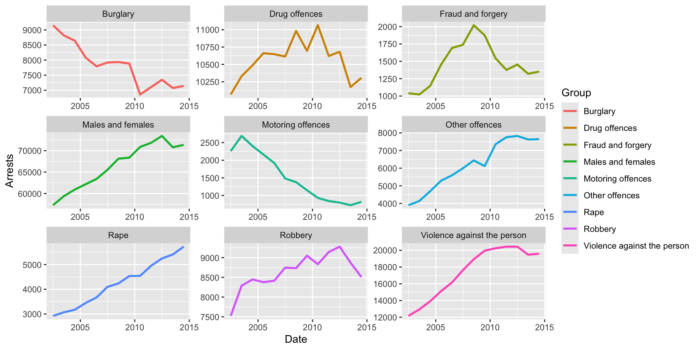

```{r install-package, include = FALSE, eval = FALSE}
# Copy and paste the following code into your console to download and install
# the `xaringan` package that contains all of the code which allows you 
# to create presentation slides in Rmarkdown
install.packages('xaringan')
```


```{r load-packages, echo = FALSE, include = FALSE, out.width="80%"}
# Add any additional packages you need to this chunk
library(tidyverse)
library(tidymodels)
library(palmerpenguins)
library(knitr)
library(xaringanthemer)
library(ggplot2)

library(readODS)
library(janitor) #for changing row names
library(RColorBrewer)

```

```{r setup, include=FALSE}
# For better figure resolution
knitr::opts_chunk$set(fig.retina = 3, dpi = 300, fig.width = 6, fig.asp = 0.4, out.width = "80%")
```

```{r load-data-and-func, echo = FALSE, warning = FALSE, message = FALSE}
Custody_PD <- read_ods('data/Population_30June2023_Annual.ods', sheet = 2)

#wrapper function for generating title of plots
wrapper <- function(x, ...) 
{
  paste(strwrap(x, ...), collapse = '\n')
}

#normalises data to range from 0 to 1
normalise_01 <- function(x)
{
  if (min(x) < 0 )
  {
    x/max(abs(x))
  } else {
    (x-min(x))/(max(x)-min(x))
  }
}


```


class: center, middle

#Correlation Between Significant Events and Prison Population of England and Wales

---

class: inverse, center, middle

#A look at population by Custody
- Here I choose a selection of 2 custody categories, "10 years to less than 14 years " and "12 months to less than 4 years".
- Y-axis is a percentage of total within subgroup of categories custody, gender, and age group. (i.e. all values within one grid element adds up to 1)


```{r Sky_plot1, echo = FALSE, warning = FALSE}
#use facet grid: (<Male/Female>,<Age group>, <custody type>)
offset <- 2


Custody_PD_sliced <- Custody_PD %>%
  row_to_names(row_number = 1) %>%
    rename("Custody" = 1) %>%
  rename("30-6-09" = 10) %>%
  select(!9) %>%
  #removing rows we don't want
  slice(-c(1:(118-offset),(185-offset):(212-offset),(279-offset):nrow(.))) %>% #looks at male and female separately, gets 6 blocks (3 age groups for 2 genders, ignores blocks for total)
  slice(-seq.int(1,5*22+1,by=22)) %>% #removes columns containing totals per category
  cbind(
    #Manually renames age and gender category
    Gender = rep(c("Male","Female"), rep(63,2)),
    Age = rep(c("Adult","18-20", "15-17"), rep(21,3))
  ) %>%
  replace(., . == "-", NA) %>%
  
  pivot_longer(!c("Custody", "Gender", "Age"), names_to = "Date", values_to = "Count") %>%
  mutate(Count = as.numeric(Count),
         Date = dmy(Date),
         year = year(Date), month = month(Date), day = day(Date)) %>%
  #filter
  filter(year >= 2015,
         Custody == c("10 years to less than 14 years",
                      "12 months to less than 4 years"
                      )
         ) %>%
  
  #grouping for plot visuals
  group_by(Custody, Gender) %>%
  mutate(perc_count_gender = Count/sum(Count, na.rm = TRUE)) 

  
  ###plotting
  custody_plot <- ggplot(data = Custody_PD_sliced,
    aes(x = Date, y = perc_count_gender, group = Gender)) +
    geom_line(aes(group = Gender, colour = Gender),
           ) +
    facet_grid(vars(Age), vars(Custody), scales = "free_y") +
    scale_color_manual(values = c(Male = "chocolate2",Female = "royalblue")) +
    labs(x = "Time", y = "Population percentage") +
    theme(text = element_text(size = 10))
  
print(custody_plot)
```

---
#REFORMS

```{R Marcel_Siddhi_graph,echo = FALSE}
knitr::include_graphics("img/Marcel_Sid.png")

```
```{R Marcel_Siddhi_graph2,echo = FALSE}
knitr::include_graphics("img/Marcel_sid_graph2.png")
```

---
#PRIME MINISTERS

#####Gordon Brown served as the Prime Minister of the UK from June 2007 to May 2010. During his tenure, crime rates in the UK were shaped by several factors including government policies, socio-economic conditions and broader trends in crime.

```{R Hanna_Vivi graph,echo = FALSE}


```
---
###1. Violence Against The Person
####Trend: Knife crime emerged as a major concern during Brown’s premiership, with recorded incidents rising, particularly in urban areas.
####Key Issues:
- High-profile stabbings and youth violence gained significant media attention.
- Gang-related knife crime became a growing problem in cities like London, Manchester, and Birmingham.

####Factors:
- Increased youth involvement in gangs.
- Economic deprivation exacerbated tensions in certain communities.

####Government Response:
- Operation Blunt 2 was launched in 2008 to curb knife possession, but public perception remained critical of the problem's persistence.

---
###2. Burglary Trends Post-2010
####After 2010, burglary rates continued to decline across the UK. This drop can be attributed to several factors, some of which were influenced by the groundwork laid by initiatives like Operation Blunt 2:

- Improved Home Security: Advancements in home security systems, such as alarms, CCTV, and stronger locks, reduced burglary opportunities.

- Continued Focus on Hotspot Policing: The policing strategies developed under Brown's era, including intelligence-led policing and hotspot targeting, persisted and evolved.

- Economic Recovery: Gradual recovery from the 2008 financial crisis may have reduced the economic desperation that drives some property crimes.
---
###3. Fraud and Forgery
####Trend: Fraud, particularly financial and benefit fraud, saw increases during Brown’s tenure.
####Key Issues:
- The 2008 financial crisis created opportunities for fraudulent activity.
- Mortgage fraud and Ponzi schemes grew during this period.
- Benefit fraud became a political issue, with accusations of widespread abuse of welfare systems.

####Factors:
- Economic hardship drove some individuals toward opportunistic crimes.
- Systemic vulnerabilities in financial institutions and benefit systems were exploited.

####Government Response:
- Efforts to detect and prevent benefit fraud were intensified, including data matching and stricter audits.

---
###4. Drug Offences
####Trend: While drug possession and distribution offenses did not see a nationwide surge, certain areas experienced spikes in drug-related violence.
####Key Issues:
- Turf wars among gangs in hotspot areas.
- An uptick in the availability of "legal highs" (psychoactive substances not yet banned).

####Factors:
- Economic inequality and lack of opportunities in affected communities.

####Government Response:
- Continued focus on disrupting drug supply chains and targeting organized crime groups.

---
###5. Rape
####Key Issues:
####Improved Reporting and Awareness:
- Public Campaigns: Greater awareness about sexual violence and campaigns to encourage victims to come forward (e.g., initiatives led by charities and government bodies) led to more reported cases.
- Police Focus: Law enforcement agencies improved their handling of sexual violence cases, making it easier for victims to report incidents.
- Changing Social Attitudes: Stigma surrounding reporting rape began to decline, prompting more survivors to seek justice.

####Better Recording Practices:
- During this period, the UK introduced reforms to ensure that sexual offenses were accurately recorded by police forces, leading to a rise in reported cases.
- Historical cases and delayed reporting also contributed to the increase in recorded numbers.

---
###6. Robbery
####Key Issues:
- Economic Strain: The 2008 financial crisis led to rising unemployment and financial hardship, driving some individuals toward opportunistic crimes like robbery.
- Youth and Gang Involvement: Youths, often linked to gangs, played a significant role in street robberies, using weapons to intimidate victims and steal valuable items like phones or jewelry.
- Urban Hotspots: Dense city areas like London and Manchester saw higher robbery rates, especially in public spaces.
- Crime Displacement: Focused policing on knife crime may have inadvertently shifted criminal activity toward robbery in some areas.

---


---
# Hello World

- Click the `Knit` button to compile your presentation

- Make sure to commit and push all resulting files to your GitHub repo

---

class: inverse, middle, center

# Using xaringan

---

# xaringan

- The presentation is created using the `xaringan` package

- Use `---` to separate slides and `--` for incremental builds

--

- Like this

---

# Layouts

You can use plain text

- or bullet points

.pull-left[
or text in two columns $^*$
]
.pull-right[
- like
- this
]

.footnote[
[*] And add footnotes
]

---

# Code

```{r boring-regression}
# a boring regression
model <- lm(dist ~ speed, data = cars)
tidy(model)
glance(model)
```

---

# Plots

```{r recode-species, echo = FALSE}
# In this chunk I'm doing a bunch of analysis that I don't want to present 
# in my slides. But I need the resulting data frame for a plot I want to present.
iris_modified <- iris %>%
  mutate(Species = fct_other(Species, keep = "setosa"))
```

```{r plot-iris, echo = FALSE}
# Code hidden with echo = FALSE
# Uses modified iris dataset from previous chunk
# Play around with height and width until you're happy with the look
ggplot(data = iris_modified, mapping = aes(x = Sepal.Width, y = Sepal.Length, color = Species)) +
  geom_point() + 
  theme_minimal() # theme options: https://ggplot2.tidyverse.org/reference/ggtheme.html
```

---

## Plot and text

.pull-left[
- Some text
- goes here
]
.pull-right[
```{r warning=FALSE, out.width="100%", fig.width=4, echo=FALSE}
# see how I changed out.width and fig.width from defaults
# to make the figure bigger
ggplot(penguins, aes(x = bill_length_mm, y = species, color = species)) +
  geom_boxplot() +
  theme_minimal()
```
]

---

# Tables

If you want to generate a table, make sure it is in the HTML format (instead of Markdown or other formats), e.g.,

```{r iris-table, echo = FALSE}
kable(head(iris), format = "html")
```

---

# Images

```{r castle, echo = FALSE, out.width = "55%", fig.align = "center", fig.cap = "Image credit: Photo by Jörg Angeli on Unsplash."}
include_graphics("img/edinburgh-castle.jpg")
```

Or you can also include a full page image. See next slide.

---


class: inverse, center, middle
background-image: url(img/edinburgh-castle.jpg)
background-size: contain
---

# Math Expressions

You can write LaTeX math expressions inside a pair of dollar signs, e.g. &#36;\alpha+\beta$ renders $\alpha+\beta$. You can use the display style with double dollar signs:

```
$$\bar{X}=\frac{1}{n}\sum_{i=1}^nX_i$$
```

$$\bar{X}=\frac{1}{n}\sum_{i=1}^nX_i$$

Limitations:

1. The source code of a LaTeX math expression must be in one line, unless it is inside a pair of double dollar signs, in which case the starting `$$` must appear in the very beginning of a line, followed immediately by a non-space character, and the ending `$$` must be at the end of a line, led by a non-space character;

1. There should not be spaces after the opening `$` or before the closing `$`.

1. Math does not work on the title slide (see [#61](https://github.com/yihui/xaringan/issues/61) for a workaround).

---

# Feeling adventurous?

- Want to find out more about `xaringan`? See https://slides.yihui.name/xaringan/#1.

- You are welcome to use the default styling of the slides. In fact, that's what I expect majority of you will do. You will differentiate yourself with the content of your presentation.

- But some of you might want to play around with slide styling. The 
`xaringanthemer` provides some solutions for this that: https://pkg.garrickadenbuie.com/xaringanthemer.

- And if you want more bells and whistles, there is also `xaringanExtra`: https://pkg.garrickadenbuie.com/xaringanExtra.
