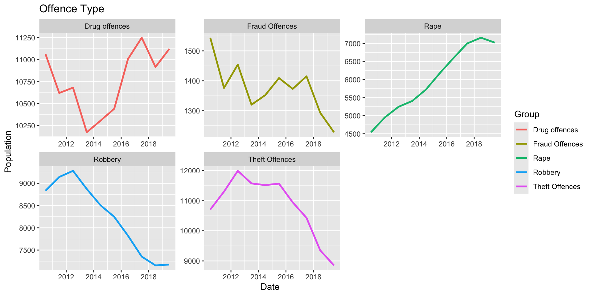

layout: true
class: inverse
---

```{r load-packages, echo = FALSE, include = FALSE, out.width="80%"}
# Add any additional packages you need to this chunk
library(tidyverse)
library(tidymodels)
library(palmerpenguins)
library(knitr)
library(xaringanthemer)
library(ggplot2)

library(readODS)
library(janitor) #for changing row names
library(RColorBrewer)

```

```{r setup, include=FALSE}
# For better figure resolution
knitr::opts_chunk$set(fig.retina = 3, dpi = 300, fig.width = 6, fig.asp = 0.4, out.width = "80%")

style_xaringan(
  code_inline_background_color = "white",
  title_slide_background_image = "img/intro_bg.png"
)

```

```{r load-data, echo = FALSE, warning = FALSE, message = FALSE}
Custody_PD <- read_ods('data/Population_30June2023_Annual.ods', sheet = 2)

offset <- 2
lockdown_start <- ymd("2020-03-26")
lockdown_end <- ymd("2020-07-04")

Custody_PD_sliced <- Custody_PD %>%
  row_to_names(row_number = 1) %>%
    rename("Custody" = 1) %>%
  rename("30-6-09" = 10) %>%
  select(!9) %>%
  #removing rows we don't want
  slice(-c(1:(118-offset),(185-offset):(212-offset),(279-offset):nrow(.))) %>% #looks at male and female separately, gets 6 blocks (3 age groups for 2 genders, ignores blocks for total)
  slice(-seq.int(1,5*22+1,by=22)) %>% #removes columns containing totals per category
  cbind(
    #Manually renames age and gender category
    Gender = rep(c("Male","Female"), rep(63,2)),
    Age = rep(c("Adult","18-20", "15-17"), rep(21,3))
  ) %>%
  replace(., . == "-", NA) %>%
  pivot_longer(!c("Custody", "Gender", "Age"), names_to = "Date", values_to = "Count") %>%
  mutate(
    Custody = case_when(
      .default = as.character(Custody),
      # Custody == "Remand" ~ "",
      # Custody == "Untried" ~ "",
      # Custody == "Convicted unsentenced" ~ "",
      # Custody == "Sentenced" ~ "",
      # Custody == "Fine defaulter" ~ "",
      Custody == "Less than or equal to 6 months" ~ "0.5 yrs",
      Custody == "Greater than 6 months to less than 12 months" ~ "0.5-1 yrs",
      Custody == "12 months to less than 4 years" ~ "1-4 yrs",
      Custody == "12 months to less than 2 years" ~ "1-2 yrs",
      Custody == "2 years to less than 4 years" ~ "2-4 yrs",
      Custody == "4 years or more (excluding indeterminate sentences)" ~ ">4.0 yrs",
      Custody == "4 years to less than 5 years" ~ "4-5 yrs",
      Custody == "5 years to less than 7 years" ~ "5-7 yrs",
      Custody == "7 years to less than 10 years" ~ "7-10 yrs",
      Custody == "10 years to less than 14 years" ~ "10-14 yrs",
      Custody == "14 years or more (excluding indeterminate sentences)" ~ ">14 yrs",
      # Custody == "Extended determinate sentence" ~ "",
      # Custody == "Indeterminate sentences" ~ "",
      # Custody == "Recalls" ~ "",
      Custody == "Sentence length not recorded" ~ "Length not recorded",
      Custody == "Non-criminal prisoners(2)" ~ "Non-criminal prisoners"
    ),
    
    Count = as.numeric(Count),
    Date = dmy(Date),
    year = year(Date), month = month(Date),
    #FOR MODELING
    lockdown_happens = ifelse(Date < lockdown_start | Date > lockdown_end, 0, 1),
    
    #rate of change
    d1_Count = diff(c(0,Count))
         )
```

class: middle, center

class: center, middle

##How do significant events correlate with changes in the prison population of England and Wales?


#####Events analysed:
#####1) Covid - 19
#####2) Penal Refroms
#####3) Prime Ministers

---

## A look at the effect of COVID-19 on prison population of different custody types

---

## Custody types

We explored the effect of lockdown measures in UK on the prison population.

--

Data we looked at is grouped by Custody type:
1. Sentenced (supergroup of all length-determined sentences, e.g. 7-10 yrs). This group contains miscellaneous subgroups such as "Sentence length not recorded".

--

2. Remand (i.e. pre-trial detention)

--

3. Non-criminal prisoners (civil offenders)

--

And everything is sorted by gender (Male & Female).
---

## Important dates used for modeling

- First lockdown enforced: $^1$ March 26, 2020

.footnote[
[1] Institute for Government analysis, https://www.instituteforgovernment.org.uk/sites/default/files/timeline-lockdown-web.pdf , retrieved November 26, 2024

[2] UK Parliment, Coronavirus: A history of English lockdown laws, https://commonslibrary.parliament.uk/research-briefings/cbp-9068/ , retrieved November 26, 2024

[3] BBC, Covid: England lockdown rules to end on 19 July, PM confirms, https://www.bbc.co.uk/news/uk-57809691
]

--
  
- Most lockdown restrictions lifted (until start of 2nd lockdown): $^2$ July 4, 2020

--

- All lockdown restrictions lifted for the last time: $^3$ June 19, 2021

---

class: center, middle

```{r echo = FALSE}
knitr::include_graphics("img/Sky-ppt_1.jpg")
```
<!--  -->

---

## How is the data modelled?

We first produced the rate of change of prisoner population using the `diff {base}` function:
```{r, eval=FALSE}
d1_Count = diff(c(0,Count))
```

--

We created a binary variable `lockdown_happens` where the value of it is 0 for all date entries when UK was not under lock-down, and 1 when it is.
```{r, eval=FALSE}
lockdown_start <- ymd("2020-03-26")
lockdown_end <- ymd("2020-07-04")
...
lockdown_happens = ifelse(Date < lockdown_start | Date > lockdown_end, 0, 1)
```

--

```{r echo=FALSE, warning = FALSE, output.lines=7}
head(
  subset(
   Custody_PD_sliced,
   year >= 2020
  ),
  6
)
```

---

## The model

**Response Variable**: the rate of change of prisoner population, `d1_Count`.

**Explainatory variables:** `lockdown_happens` and `Date` .

--

We made three simple linear models:

```{r eval=FALSE}
custody_fit_yesInt <- linear_reg() %>%
  set_engine("lm") %>%
  fit(<...>, data = Custody_modeling)
```

- `d1_Count ~ Date + lockdown_happens + Date * lockdown_happens`
This takes into consideration of both explanatory variables and their interaction effect.

--

- `d1_Count ~ Date + lockdown_happens`
This takes into consideration of both explanatory variables without interaction effect.

--

- `d1_Count ~ lockdown_happens`
This takes into consideration of just the lockdown indicator variable.

---

## The model

We then applied this model to the a subset of our data:
- Age group: Adults (others are 15-17 and 18-20)
- custody type: Sentenced
- year > 2014 (because some data under Sentenced don't have entry until 2015)

---

class: center, middle

```{r echo = FALSE}

```
<!--  -->

---

```{r echo = FALSE, warning = FALSE, message = FALSE}
Custody_modeling <- Custody_PD_sliced %>%
  filter(
    year >= 2015,
    Age == "Adult",
    Custody == c(
      "Sentenced"
    )
  )

custody_fit_yesInt <- linear_reg() %>%
  set_engine("lm") %>%
  fit(d1_Count ~ Date + lockdown_happens + Date * lockdown_happens, data = Custody_modeling)

custody_fit_noInt <- linear_reg() %>%
  set_engine("lm") %>%
  fit(d1_Count ~ Date + lockdown_happens, data = Custody_modeling)

custody_fit_Simple <- linear_reg() %>%
  set_engine("lm") %>%
  fit(d1_Count ~ lockdown_happens, data = Custody_modeling)
```

## Results for the model with interaction effect

- `d1_Count ~ Date + lockdown_happens + Date * lockdown_happens`
```{r echo=FALSE}
tidy(custody_fit_yesInt)
```

And the R-squared value is:
```{r echo=FALSE}
glance(custody_fit_yesInt)$r.squared
```

---

## Results for the model without interaction effect

- `d1_Count ~ Date + lockdown_happens`
```{r echo=FALSE}
tidy(custody_fit_noInt)
```

And the R-squared value is:
```{r echo=FALSE}
glance(custody_fit_noInt)$r.squared
```

---

## Results for the model only depending on the indicator variable

- `d1_Count ~ lockdown_happens`
```{r echo=FALSE}
tidy(custody_fit_Simple)
```

And the R-squared value is:
```{r echo=FALSE}
glance(custody_fit_Simple)$r.squared
```

---

## Interpretation of the model


- `d1_Count ~ Date + lockdown_happens + Date * lockdown_happens`
```{r echo=FALSE}
glance(custody_fit_yesInt)$r.squared
```

- `d1_Count ~ Date + lockdown_happens`
```{r echo=FALSE}
glance(custody_fit_noInt)$r.squared
```

- `d1_Count ~ lockdown_happens`
```{r echo=FALSE}
glance(custody_fit_Simple)$r.squared
```

-- 

As we can see the models all gave similar R-squared values, albeit very low (suggesting the model was not great).

Applying Occam's Razor, the method we tried suggests that the rate of change of prison population was indeed impacted by COVID-19 lockdown measures, and does not have a correlation with time.

---
#REFORMS

###The penal reforms we will be looking at to find a correlation are:
####1) Legal Aid, Sentencing and Punishment of Offenders Act 2012 (LASPO) - 1st May 2012
 - The LASPO Act 2012 reformed legal aid, sentencing, offender rehabilitation, and bail, aiming to reduce prison populations and restrict legal aid eligibility. It introduced new offenses, toughened penalties for some crimes, and focused on efficiency in the criminal justice system.

####2) Crime and Courts Act 2013 - 25th April 2013 
- The Crime and Courts Act 2013 established the National Crime Agency, abolished the Serious Organised Crime Agency and the National Policing Improvement Agency, and reformed the judiciary, courts, and border control, including provisions on drugs and driving offenses.
---
####3) Offender Rehabilitation Act 2014 - 3rd February 2015
- An Act to make provision about the release, and supervision after release, of offenders; to make provision about the extension period for extended sentence prisoners; to make provision about community orders and suspended sentence orders; and for connected purposes.

####4) Criminal Justice and Courts Act 2015 - 12th February 2015
- The Offender Rehabilitation Act 2014 reformed offender management before and after conviction, created new offenses related to healthcare neglect, police misconduct, and privacy violations, and made provisions on judicial review and court procedures.

---

```{R Marcel_Siddhi_graph2,echo = FALSE, fig.width=4, fig.height=4,}
knitr::include_graphics("img/Marcel_sid_graph2.png")
```
---
.pull-left[
- Siddhi
- Marcel
]
.pull-right[
```{R Marcel_Siddhi_graph3, out.width="500%", fig.width=4,echo = FALSE}

knitr::include_graphics("img/boxplot.png")

```
]
---
#PRIME MINISTERS - David Cameron
#####David Cameron, a Conservative, was the UK Prime Minister from 2010 to 2016. He implemented austerity measures and held the 2016 EU referendum, leading to Brexit and his resignation.

```{R Hanna_Vivi graph,echo = FALSE}


```
---
###Key Insights from Results:

####Drug Offenses:
- Prison populations for drug offenses significantly declined as Cameron's government prioritized dismantling organized drug networks and de-emphasized minor drug possession. Expanded funding for drug rehabilitation programs and harm reduction reflected this shift.
####Fraud and Forgery:
- Fraud-related imprisonment decreased, driven by a shift toward online financial crimes, which were harder to prosecute under reduced police resources. Cameron's government encouraged private sector involvement in financial crime prevention.
####Motoring Offenses:
- A consistent decline in motoring offense imprisonment occurred due to increased use of automated systems (e.g., speed cameras) and alternative penalties like fines. Resource cuts impacted manual enforcement further.
---

####Rape and Sexual Offenses:
- Increased awareness campaigns and judicial reforms led to rising imprisonment for rape offenses. Initiatives like #MeToo and longer sentencing reflected societal shifts.
####Robbery:
- Prison populations for robbery offenses fluctuated, peaking around 2013 due to economic challenges and declining thereafter. Urban safety initiatives and improved surveillance reduced robbery rates.
####Violence Against the Person:
- Prison populations grew until 2013, influenced by tougher sentencing policies. Cameron introduced domestic violence legislation and community-based violence prevention programs.
####Burglary: 
- Declining arrests reflect improved security technologies and reduced police presence under austerity. Emphasis on community policing and public safety campaigns shaped outcomes.

---
#PRIME MINISTERS - Theresa May

#####Theresa May is a British politician who served as the Prime Minister of the United Kingdom from July 2016 to July 2019. A member of the Conservative Party, she was the second woman to hold the office of Prime Minister, after Margaret Thatcher.

```{R Hanna_Vivi_2 graph,echo = FALSE}


```
---
###Key Insights from Results:

####Drug Offenses:
- Drug-related imprisonments fluctuated as May emphasized tackling organized drug operations and county lines. Budget constraints limited police capacity, but efforts were made to safeguard vulnerable individuals exploited in drug trafficking.
####Fraud and Forgery:
- Fraud arrests declined as traditional financial crimes shifted to cyber fraud. May prioritized cybercrime prevention by strengthening the National Crime Agency (NCA) and encouraging businesses to adopt stronger fraud detection measures.
####Motoring Offenses:
- Motoring offense imprisonments consistently declined due to technological advancements (e.g., speed cameras) and reduced police traffic enforcement capacity under austerity. May promoted automated systems and public awareness campaigns for road safety.
---

####Rape and Sexual Offenses:
- Increased awareness campaigns, like #MeToo, and harsher sentencing policies resulted in a rise in imprisonments for sexual offenses. May expanded victim support services and improved police training for handling sensitive cases.
####Robbery:
- Robbery imprisonment trends fluctuated, reflecting targeted interventions in high-crime areas and economic challenges. May emphasized urban safety through community policing and data-driven resource allocation.
####Violence Against the Person:
- Prison populations for violent crimes grew during May's tenure, reflecting increased reporting and tougher sentencing. She introduced legislation to combat domestic violence and funded community-based initiatives to address knife crime and hate crimes.
####Burglary:
- Declining arrests reflected improved home security technologies but highlighted gaps in enforcement due to reduced police presence under austerity. Community policing and public safety awareness were prioritized.

---
#####The graph below shows how different leadership styles, policy priorities, or external events under Cameron and May could have influenced prison population trends. The Point forecast (blue) represents a steady, expected trajectory, derived from the prison population data from Cameron's period, while the Total_pop (red) highlights the variability and challenges that arose during May's period. 

