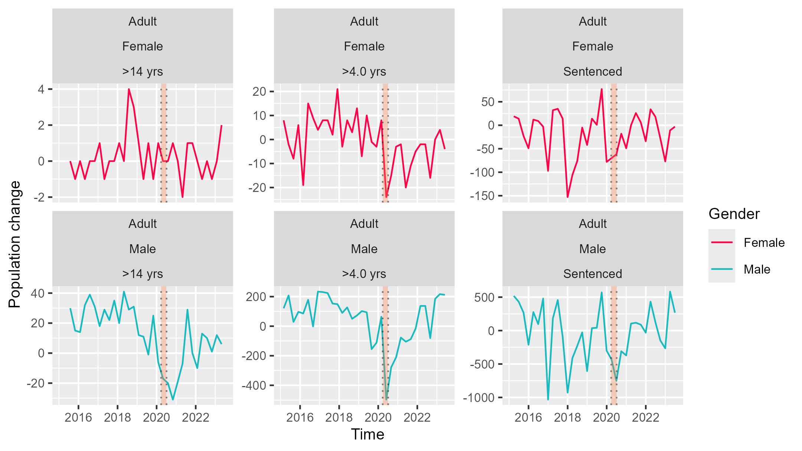
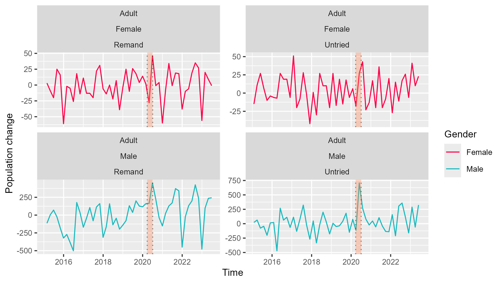
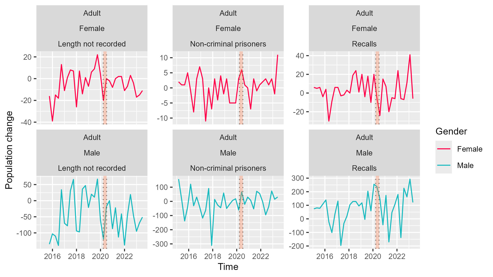

```{r setup, include = FALSE}
knitr::opts_chunk$set(echo = TRUE)
```


```{r load-lib, include = FALSE}
library(tidyverse)
library(ggplot2)
library(tidymodels)

#PACKAGES YOU MIGHT NEED TO INSTALL
library(readODS)
library(janitor) #for changing row names
library(RColorBrewer)
library(broom)

```


```{r load-data, include=FALSE}
Ethnic_PD <- read_ods('data/Population_30June2023_Annual.ods', sheet = 14)

#wrapper function for generating title of plots
wrapper <- function(x, ...) 
{
  paste(strwrap(x, ...), collapse = '\n')
}

#normalises data to range from 0 to 1
normalise_01 <- function(x)
{
  if (min(x) < 0 )
  {
    x/max(abs(x))
  } else {
    (x-min(x))/(max(x)-min(x))
  }
}


```


## Research Question: Correlation between significant events and prison population of England and Wales

We have picked some major worldwide events to see whether if there is a noticeable correlation between them and changes in prison population.

## Data

We explored the 'Prison population by type of custody, age group and sex' section of the data.

The data set we looked at contained many custody groups like remand(individuals that are held in prison until their trial/hearing), intermediate sentence(individuals that have to stay in custody until they have been approved to be safe for the public), fine defaulter(individuals that are in prison due to refusing to pay a fine) and recalls(individuals that were released on parole/license but broke the rules of their probation and are back in prison). 


## The effect of COVID-19 on prison population of different custody types
*Sky and Maggie*

We analysed the rate of change in the prisoner population, `d1_Count`, over time, using different subsets of custody type.

### Methods

We created an indicator variable `lockdown_happens` which takes the value of 1 during the first lockdown period (2020 March 26 to July 4) [^covid_date1][^covid_date2], and 0 at any other given time. This will be used as an explanatory variable for our model.

We used linear regression for our models, the response variable being the rate of change of prisoner population `d1_Count`, and the explanatory variables being `lockdown_happens` and `Date`. `Date` is included to test whether there was a trend with respect to time in `d1_Count`.

The reason we chose these variables for the following reasons. From preliminary assessment of the data through graphs, we saw that although `d1_Count` is unstable, it oscillates roughly around 0 throughout time, and in some cases like Extended determinate sentences, there appeared to be a decreasing trend with respect to time.


1. **Model 1 (custody_fit_yesInt)**: This model included the variables `Date`, `lockdown_happens`, and the interaction between these two variables (`Date * lockdown_happens`). This model assesses how the lockdown period affected the population change in sentenced custody over time while accounting for any general time trend.

2. **Model 2 (custody_fit_noInt)**: This model is did not include interaction term and only considers the effects of `Date` and `lockdown_happens`.

3. **Model 3 (custody_fit_Simple)**: The simplest model of the three, which only uses `lockdown_happens` as a predictor.

### Results

#### Subset "adult sentenced"
This subset showed the strongest response to the specified lock down dates.

**Model 1 `(custody_fit_yesInt)`** The all estimated coefficients are statistically insignificant (p-values > 0.7), suggesting that this model is invalid. $\bar{R}^2 = 0.166$ (adjusted $R^2$) , it is the lowest among the models we used.

**Model 2 `(custody_fit_noInt)`** Without the interaction effect, `lockdown_happens` has a negative estimated coefficient of $-600 \pm 100$ (SE), while `Date`’s coefficient is insignificant (p = 0.702). $\bar{R}^2 = 0.170$.

**Model 3 `(custody_fit_Simple)`** With the only explanatory variable being `lockdown_happens`, it's estimated coefficient is $-600 \pm 100$ (SE), similar to Model 2. This suggests that during the period of lockdown, the rate of change of prison population for the selected subset is about 600 less than during normal times. It has the highest adjusted R-squared (0.1734), suggesting that `lockdown_happens` is the key factor of variance in d1_Count without additional predictors or interactions. $\bar{R}^2 = 0.173$, the highest among the models used.

#### Other subsets
Other subsets showed different responses to COVID:

| Subset chosen | $\bar{R}^2_{yesInt}$ | $\bar{R}^2_{noInt}$ | $\bar{R}^2_{simple}$  | `lockdown_happens` coefficient in `(custody_fit_Simple)` |
|---|---|---|---|---|
| Sentenced | 0.166 |  0.170  |  0.173  | $600 \pm 100$ |
| Remand | 0.0998  | 0.0777  | 0.0249  | $140 \pm 60$ |
|  Length not recorded |  0.00459 | -0.00426  | 0.000854 | $-20 \pm 10$ |  |

Remand showed a positive correlation with lockdown (it was negative for Sentenced), and Length not recorded did not show any noticeable response.







### Interpretation

Applying Occam's Razor, the simplest model that still provides meaningful explanatory power should be used. Our result suggests time (i.e. `Date`) has no significant correlation with change in adult sentenced prisoners, and lockdown in UK has a correlation with the decrease in population.
   
The relatively low $\bar{R}^2$ values across all models is expected, since all sorts of external factors and the inaccuracies of our model can influence the results. Our linear model is simplistic in nature, and `lockdown_happens` is only based on dates that might not accurately reflect prisoner flux dynamics (i.e. did lockdown itself caused the change in prison population, or COVID-19 itself, some other factors, or a combination of everything?).

## Penal Reforms

We tested prison population groups against key penal reform dates, using multiple models; T-test.

## Method

The data was simplified to Remand, Sentenced, and Total population because the original monthly data required merging datasets for specific crime types, reducing accuracy. The system used to measure the data changes in 2009–2010 and offence name changes in 2015 led to testing the idea of non-violent vs. violent crime, but this was narrowed to Remand and Sentenced. This was due to some laws targeting Remand and crime type data being limited to immediate custodial sentences. A generalisation suggested non-violent crimes with minimal societal impact might result in Remand, while violent crimes had a higher likelihood of the same.
Key reform dates were:

•	2012/05/01:Legal Aid, Sentencing and Punishment of Offenders Act 2012

•	2013/04/25:Crime and Courts Act 2013

•	2014/03/13:Offender Rehabilitation Act 2014

•	2015/02/12:Criminal Justice Act 2015

These aimed to reduce prison populations. Data was assigned a TRUE Boolean if within 8 months of an event, chosen through T-tests to assess statistical significance, as acts took time to affect large populations.

```{R Marcel_Siddhi_graph2,echo = FALSE, fig.width=4, fig.height=4,}
knitr::include_graphics("img/MS.png")
```


```{r}
PR_monthly <- readRDS("PR_monthly.rds")

PR_t_test <- t.test(Total_pop ~ event_occurred, data = PR_monthly) %>%
  tidy()
print(PR_t_test)
```


Other variables such as Age groups and Sex were tested with the T-test, however, proved to be weakly correlated compared to Remand, Sentenced and Total populations.

Next the data included a new variable (Date_num) which was the date in terms of integers, this was used to link correlation between the date and event occurred in the linear model.
A linear model was used to determine the correlation between Total and remand populations against event_occured (Remand was chosen due to the effects of the reforms being the clearest)

```{r eval = FALSE}
PR_model_5 <- linear_reg() %>%
  set_engine("lm") %>%
  fit(Total_pop ~ Date_num + event_occurred + Sentenced_pop + Remand_pop, data = PR_monthly) 
model_summary <- summary(PR_model_5$fit)
model_summary

```

Model 4,5 and 7 performed the best
The difference between model 4 and 5 was Remand_pop being added this increased the fit of the model by ~27%
Model 5 and 7 differ by the response variable (Total_pop) and explanatory variable (Remand_pop) being switched for greater insight into Remand_pops effect
The other models are 1-3 being a reduction in explanatory variable which reduced R^2 leading to decreased fit, 6 and 8 being the same as 7 but with reduced explanatory variable leading to the same issue as 1-3.

The linear models were tested against themselves using 5 cross-validation splits. We used RMSE and MAE to compare the models, models that used different response variables could not be directly compared.

```{r}
average_results <- readRDS("average_results.rds")

print(average_results)
```


We can use these results to conclude that model 5 is better than model 4, this was used to determine the best models. RMSE and MAE are measures of error with the smaller the error the better the model.


### Prime Minister
For the Prime Minister section, we analyzed the full data set across all years to compare crime trends before and during each Prime Minister's term. However, limitations included difficulty in directly linking changes to specific policies, leading to some assumptions. To address this, we examined different crime types and related policies.

#### Main Steps Used in The Data

**1.Data Preparation** : Renamed columns, combined multiple datasets, and added an event indicator (before/after 2016-07-13).

**2.T-Test** : Compared average population before and after the event date. Created a boxplot to visualize differences.

**3.Linear Regression** : Modeled the relationship between population, time, and the event using regression. Evaluated the model’s accuracy with R-squared values.

**4.Time Series Forecasting** : Used historical data (2010–2016) to forecast population for 36 months. Compared forecasts to actual data from 2016–2019.

The ARMIA model (with parameters being: (1,0,0)(2,0,0)[12]) is used because it is a powerful, interpretable, and versatile tool for analysing and forecasting time series data, especially when patterns like trends and seasonality are key components of the data. It can be used to predict historic trends with later trends to see any change in trend, however, it can sometimes not be used to directly compare due insufficient data.

**5.Visualizations** : Plotted population trends and compared forecasts vs. real data using clear, color-coded charts.

#### Results (Key Issues and Possible Related Government Responses) 

#### Lord Cameron(2010-2016):

##### 1.Drug Offences

**Trend** : Significant decline after 2010

**Key Issues** : Shift from punitive measures to rehabilitation and tackling high-level trafficking.

**Government Response** : Expanded funding for drug treatment and harm reduction initiatives.

##### 2.Fraud Offences

**Trend** : Declined, reflecting a transition to cyber fraud.

**Key Issues** : Limited resources allocated for investigating complex fraud and increasing online scams

**Government Response** : Strengthened cybercrime units and encouraged private sector involvement in fraud prevention. 

##### 3.Rape

**Trend** : Reports and imprisonments steadily increased.

**Key Issues** : Greater awareness and public demand for action

**Government Response** : Funded support services and introduced training for handling rape cases.


##### 4.Robbery

**Trend** : Peaked early, then declined significantly

**Key Issues** : Economic recession initially drove rates up, while urban safety measures later reduced offenses.

**Government Response** : Promoted urban safety initiatives like CCTV and improved penalties for violent robbery.


##### 5.Theft Offences 

**Trend** : Declined after an intial rise.

**Key Issues** : Technological advancements in security deterred theft.

**Government Response**: Supported public safety campaigns and neighbourhood watch programs.


#### Theresa May(2016-2019):

##### 1.Drug Offences

**Trend** : Fluctuated, with a rise linked to county lines operations.

**Key Issues** : Vulnerable individuals exploited by organized crime.

**Government Response** : Strengthened the National Crime Agency (NCA) and introduced targeted interventions.


##### 2.Fraud Offences

**Trend** : Continue declined due to a shift towards cyber fraud. 

**Key Issues** : Limited resources for complex fraud investigations.

**Government Response** : Promoted private sector collaboration and expanded cybercrime units.


##### 3.Rape

**Trend** : Reports rose sharply, reflecting increased awareness

**Key Issues** : Persistent gaps in convictions despite higher reporting.

**Government Response** : Improved victim support and police training for sensitive cases.

##### 4.Robbery

**Trend** : Steep decline due to improved surveillance and urban safety measures.

**Key Issues** : Economic challenges and reduced police presence.

**Government Response** : Strengthened penalties and promoted urbvan safety programs.


##### 5.Theft Offences

**Trend** : Consistently declined due to imporved security measures.

**Key Issues** : Shift from physical theft to online fraud

**Government Response** : Supported neighborhood watch programs and public awareness campaigns. 

#### Final Analysis

Based on the final graph in the presentation slides, here are the key observations :

The graph compares the predicted prison population (blue line) with the actual population (red line). During Cameron's period, the population followed a steady forecast, but under May, the red line shows more fluctuations and even deviates from the forecast, indicating unexpected challenges or policy changes. The orange lines (Hi 95 and Lo 95) represent expected variation, but the actual population sometimes falls outside this range, showing greater instability during May's term.


## References

[^origin]: Ministry of Justice, Offender Management Statistics Quarterly publications, "Prison population: 30 June 2023", retrieved on November 8, 2024, available at: https://www.gov.uk/government/collections/offender-management-statistics-quarterly

[^covid_date1]: Institute for Government analysis, https://www.instituteforgovernment.org.uk/sites/default/files/timeline-lockdown-web.pdf , retrieved November 26, 2024

[^covid_date2]: UK Parliment, "Coronavirus: A history of English lockdown laws", https://commonslibrary.parliament.uk/research-briefings/cbp-9068/ , retrieved November 26, 2024

Legal aid, sentencing and punishment of offenders act 2012 (LASPO):
https://www.legislation.gov.uk/ukpga/2012/10/contents

Crime and Courts Act 2013:
https://www.legislation.gov.uk/ukpga/2013/22/contents

Offender Rehabilitation Act 2014:
https://www.legislation.gov.uk/ukpga/2014/11/contents

Criminal Justice and Courts Act 2015:
https://www.legislation.gov.uk/ukpga/2015/2/contents